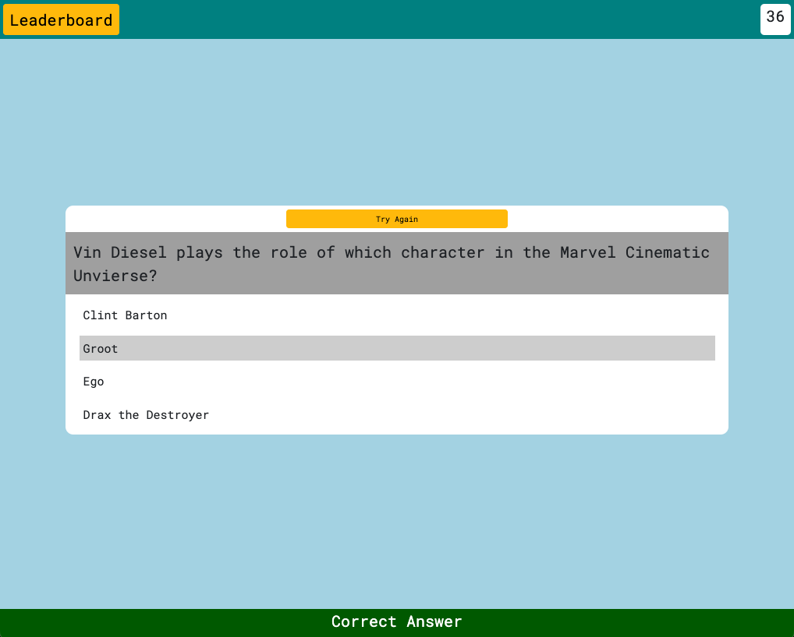

# AnswerMe

- AnswerMe is a simple quiz application that generates and presents the user with 10 random questions and sets a timer for 100 seconds to keep the competitive spirit alive.

## Usage

[Click Here](https://akramov-farhod.github.io/quiz-application/) to navigate to AnswerMe.

- Clicking the Start button will being the quiz.
- Clicking the Try Again button will being the quiz anew.
- Clicking Leaderboard button will show the current leaderboard.
- Leaderboard can be hidden by clicking the Hide button once the leaderboard is visible.
- Leaderboard can be cleared by clicking the Clear button once the leaderboard is visible.

## Screenshots

- 

  

  Landing Page
  

  
  

- 

  

  Correct Answer
  

  
  

- 

  

  Wrong Answer
  

  
  

- 

  

  Leaderboard
  

  
  

## License

None
